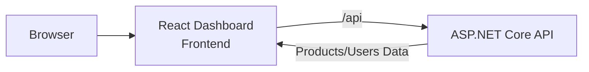

# GitHub Practice Demo

A full-stack web application built with React, TypeScript, and ASP.NET Core. This project demonstrates modern web development practices with a dashboard application for managing products and users.

## Features

- **Dashboard** - Main application shell with routing and navigation
- **Products** - Product management and catalog
- **Users** - User administration and team management
- **ASP.NET Core API** - Backend APIs with CRUD operations and in-memory data storage

## Quick start

Requirements:

- [.NET 10 SDK](https://dotnet.microsoft.com/download/dotnet/10.0)
- Node.js `>=20.19 <25`

On Windows PowerShell:

```powershell
npm.cmd install
npm.cmd run dev
```

On macOS or Linux:

```bash
npm install
npm run dev
```

Open [http://localhost:3000](http://localhost:3000). The single command starts all four development processes:

| Application | URL | Responsibility |
|---|---:|---|
| Dashboard shell | `http://localhost:3000` | Composition, navigation, routing |
| Products remote | `http://localhost:3001` | Product CRUD and summary |
| Users remote | `http://localhost:3002` | User CRUD and summary |
| ASP.NET Core API | `http://localhost:5000` | APIs, health, production host |

Each remote can be opened directly on its own port for isolated development.

## Production mode

The production build writes the Dashboard to the API's `wwwroot` and the two remotes to `/remotes/products` and `/remotes/users`. ASP.NET Core then serves the entire application from one origin.

```powershell
npm.cmd run build
npm.cmd start
```

Open [http://localhost:5000](http://localhost:5000).

Use `npm run ...` instead of `npm.cmd run ...` outside PowerShell environments that block `npm.ps1`.

## Verify everything

```powershell
npm.cmd run verify
```

This command runs:

1. Strict TypeScript checks for all three frontends.
2. Three production Module Federation builds.
3. A Release build of the .NET solution with warnings treated as errors.
4. Zero-dependency backend domain checks.
5. A live HTTP smoke test covering health, validation, CRUD, summaries, and dashboard activity.

## Architecture



The application consists of:
- **Frontend**: React applications with TypeScript for type safety
- **Backend**: ASP.NET Core API providing REST endpoints
- **Communication**: HTTP APIs for data exchange

## Project structure

```
.
├── apps/                    React applications
│   ├── dashboard/          Main dashboard shell
│   ├── products/           Products application
│   └── users/              Users application
├── backend/                ASP.NET Core backend
├── packages/shared/        Shared UI components and utilities
└── scripts/                Build and utility scripts
```

## API surface

| Method | Endpoint | Description |
|---|---|---|
| `GET` | `/health` | Service health |
| `GET/POST` | `/api/products/` | Search/list or create products |
| `GET/PUT/DELETE` | `/api/products/{id}` | Read, update, or delete a product |
| `GET` | `/api/products/summary` | Product KPI data |
| `GET/POST` | `/api/users/` | Search/list or create users |
| `GET/PUT/DELETE` | `/api/users/{id}` | Read, update, or delete a user |
| `GET` | `/api/users/summary` | User KPI data |
| `GET` | `/api/dashboard/activity` | Recent cross-domain activity |

Data is intentionally in memory so the demo has no database or Docker prerequisite. It resets whenever the API restarts. Replace the repository implementations behind `IProductRepository` and `IUserRepository` when adding persistent storage.

## Useful commands

| Command | Purpose |
|---|---|
| `npm run dev` | Start API and all frontends |
| `npm run typecheck` | Check all TypeScript workspaces |
| `npm run build:web` | Build the three production frontends |
| `npm run build` | Build frontend and .NET production artifacts |
| `npm run test` | Run backend checks and live API smoke test |
| `npm run verify` | Run the complete verification pipeline |
| `npm run start` | Start the already-built production app |

## Next Steps

- Add persistent database using Entity Framework Core
- Implement authentication and authorization
- Add API validation and error handling
- Deploy to cloud services
- Add unit and integration tests

